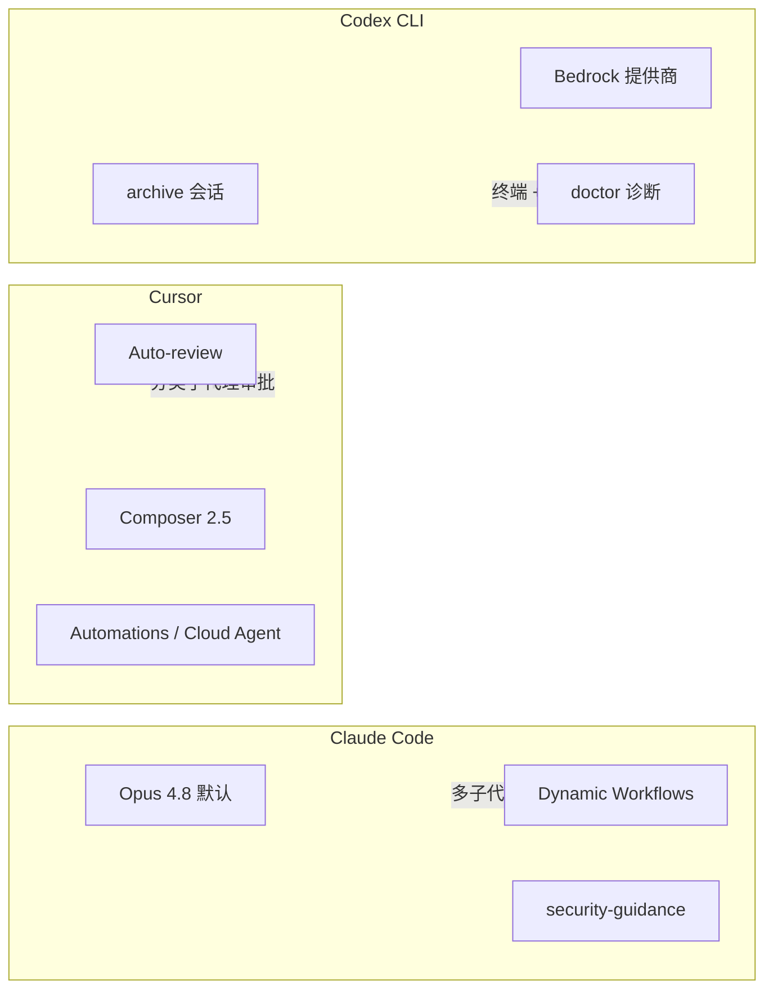

# 2026-06-02 AI 每日总结

> 生成时间：2026-06-02（UTC）  
> 环境：Cursor Cloud Agent（Linux）  
> 本地 CLI 测试版本：Claude Code **2.1.159**、Codex CLI **0.136.0**

## 今日要闻速览

| 类别 | 事件 |
|------|------|
| 行业 | Anthropic 完成 **650 亿美元 Series H**，投后估值约 **9650 亿美元**，超过 OpenAI（约 8520 亿）；双方均传将推进 IPO |
| 产品 | Claude Code 主推 **Opus 4.8**、**Dynamic Workflows**、**security-guidance** 插件 |
| 产品 | Cursor **3.6** 推出 **Auto-review** 运行模式；**Composer 2.5** 为默认编码模型之一 |
| 产品 | OpenAI **Codex CLI 0.136.0**（6/1 发布）：会话归档、Bedrock、OSC 8 可点击链接等 |
| 传闻 | Anthropic **Mythos** 级模型在安全加固后或于数周内扩大公开范围（未官宣具体日期） |

## 分主题文档

- [行业与融资](./industry.md)
- [Claude Code 特性与本地测试](./claude-code.md)
- [Cursor 特性与本地测试](./cursor.md)
- [Codex 特性与本地测试](./codex.md)

## 交叉对比（编码 Agent 三角）

## 本地测试总评

| 工具 | 能否完整跑通 AI 对话 | CLI/特性可验证程度 | 一句话感受 |
|------|---------------------|-------------------|------------|
| Claude Code 2.1.159 | 否（需 `/login`） | 高（版本、agents、help） | 子代理与 effort 体系成熟，云环境需先配认证 |
| Codex 0.136.0 | 否（401 无 API Key） | 高（doctor、archive、features、exec 管线） | 诊断与 feature flag 很完善；`-p` 已改为 `--profile` 易踩坑 |
| Cursor（本自动化） | 是（Cloud Agent） | 中（无法测桌面 Auto-review UI） | Automations + Composer 2.5 适合无人值守日报类任务 |

## 参考链接

- [Claude Code Week 22 更新](https://code.claude.com/docs/en/whats-new/2026-w22)
- [Claude Code Dynamic Workflows](https://code.claude.com/docs/en/workflows)
- [Cursor Changelog](https://cursor.com/changelog)
- [Codex Changelog](https://developers.openai.com/codex/changelog)
- [Codex CLI v0.136.0 Release](https://github.com/openai/codex/releases/tag/rust-v0.136.0)
